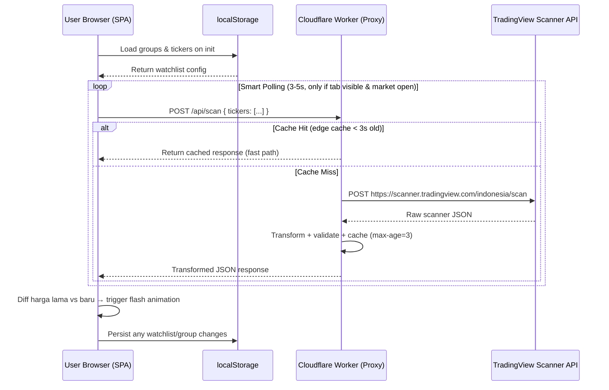

# Product Requirement Document (PRD)
## IDX Live Stock Monitoring Dashboard

Name : IDXGP
**Versi:** 1.0
**Status:** Draft — Siap Eksekusi
**Budget:** Rp 0 (Free Tier Only)
**Author:** Senior Technical PM / Principal Software Architect

---

## 1. Executive Summary & Objectives

### 1.1 Problem Statement

Retail trader saham IDX (Indonesia Stock Exchange) yang ingin memantau pergerakan harga saham secara real-time dalam bentuk watchlist/grup kustom (misalnya "Grup Banking", "Grup Mining") menghadapi tiga hambatan utama:

1. **Biaya tinggi** — API data real-time resmi (IDX, refinitiv, dsb.) berbayar mahal dan tidak masuk akal untuk trader individu.
2. **Delay data** — Aplikasi broker gratis umumnya delay 15-20 menit atau membatasi jumlah saham yang bisa dipantau sekaligus dalam satu layar grup.
3. **Tidak ada personalisasi grup** — Sulit membuat watchlist tersegmentasi per sektor/strategi trading pribadi yang bisa diakses cepat lintas device tanpa install app native.

### 1.2 Core Value Proposition

Dashboard web ringan (SPA), 100% gratis untuk dioperasikan (zero backend cost), yang menyediakan data kuotasi saham IDX mendekati real-time (delay bawaan TradingView, umumnya sekunder-level untuk data non-exchange-licensed), dengan:
- Grup watchlist kustom tak terbatas (disimpan lokal di browser).
- Smart polling yang hemat resource — hanya aktif saat dibutuhkan (tab aktif, jam bursa buka).
- UI grid ala terminal trading profesional, tapi jalan di static hosting gratis.

### 1.3 Key Success Metrics

| Metrik | Target |
|---|---|
| Latency end-to-end (request → render di UI) | < 300ms (di luar RTT jaringan pengguna) |
| Efisiensi pemanggilan API (request harian ke CF Worker) | Jauh di bawah 100.000 req/hari (limit free tier Cloudflare Workers) per pengguna aktif wajar |
| Biaya operasional | Rp 0 / bulan (Cloudflare Pages + Workers free tier, tanpa database berbayar) |
| First Contentful Paint | < 1 detik (koneksi 4G rata-rata) |
| Uptime frontend | ~100% (static hosting Cloudflare Pages, tidak bergantung origin server) |
| Error recovery | Semua kategori error di Section 6 memiliki UX fallback terdefinisi, tidak ada "blank screen" |

---

## 2. Architecture & System Design

### 2.1 Diagram Alur Data



**Komponen:**
1. **Client Browser (SPA)** — Vue 3 via CDN, tidak ada build step wajib. Menyimpan state UI, watchlist, dan preference.
2. **Cloudflare Worker (Proxy)** — Edge function stateless, tugasnya: menerima request dari frontend, meneruskan ke TradingView Scanner API, transformasi payload, caching, dan menangani CORS.
3. **TradingView Scanner API** — Sumber data eksternal, tidak resmi/undocumented public endpoint, sehingga proxy WAJIB untuk menghindari CORS block dan menyembunyikan detail request dari client.

### 2.2 Security & CORS Policy di Cloudflare Worker

**Kebijakan CORS:**
- Worker HARUS menambahkan header `Access-Control-Allow-Origin` yang di-restrict ke domain Cloudflare Pages sendiri (bukan wildcard `*`), untuk mencegah proxy disalahgunakan pihak lain sebagai open proxy gratis ke TradingView.
- Contoh: `Access-Control-Allow-Origin: https://idx-dashboard.pages.dev` (bukan `*`).
- Preflight `OPTIONS` request harus direspons Worker langsung tanpa diteruskan ke TradingView (hemat kuota request upstream).

**Kebijakan Keamanan Tambahan:**
- **Rate limiting per-IP** menggunakan Cloudflare Workers KV (opsional, masih dalam free tier — 100k baca/hari) atau Durable Objects hanya jika benar-benar diperlukan; default: mengandalkan edge caching sebagai rate limiter alami.
- **Input validation** ketat pada payload masuk — daftar ticker harus di-whitelist format regex (`^[A-Z]{4}$` untuk kode saham IDX 4 huruf), request dengan payload di luar format ditolak dengan HTTP 400 sebelum diteruskan ke upstream.
- **No API key exposure** — karena TradingView Scanner API tidak butuh API key (public endpoint), tidak ada secret yang perlu disembunyikan; namun Worker tetap wajib jadi satu-satunya pintu keluar (client tidak boleh fetch langsung ke TradingView karena CORS akan diblok browser TradingView sendiri).
- **User-Agent spoofing minimal** — Worker meneruskan request dengan header `User-Agent`/`Origin` yang meniru browser biasa (bukan default `Cloudflare-Worker`) agar tidak diblokir upstream sebagai bot; ini standard practice untuk proxy edge function, bukan untuk menyamarkan identitas berbahaya.

### 2.3 Caching Strategy

**Edge Caching Layer:**
- Response dari Worker ke client diberi header `Cache-Control: public, max-age=3`.
- Cloudflare Cache API (`caches.default`) digunakan di dalam Worker untuk cache response per kombinasi unique ticker-list (cache key = hash dari sorted ticker array), sehingga jika 2 user yang berbeda memantau grup ticker yang identik dalam window 3 detik yang sama, hanya 1 request yang benar-benar diteruskan ke TradingView.

**Kalkulasi Budget Request Harian (100k req/hari limit):**

| Skenario | Kalkulasi | Total Req/Hari |
|---|---|---|
| Polling interval 4 detik, jam bursa aktif 6.5 jam (09:00-16:00 dengan istirahat 12:00-13:30 = 5 jam efektif) | 5 jam × 3600 detik / 4 detik = 4.500 polling cycle/hari/user | Per user aktif penuh sesi |
| Dengan cache hit-rate asumsi 70% (banyak user memantau grup ticker sama) | 4.500 × 30% cache-miss = 1.350 req ke upstream/hari/pola unik | Jauh di bawah limit |
| Estimasi kapasitas pengguna concurrent unik pattern sebelum menyentuh limit | 100.000 / 1.350 ≈ 74 pola watchlist unik simultan | Cukup untuk skala personal/small-team project |

**Catatan:** Jika traffic bertumbuh melebihi estimasi ini, mitigasi lanjutan (Section 5.2) wajib diaktifkan.

---

## 3. Data Contracts & JSON Schemas

### 3.1 Request Payload Schema — Client ke Cloudflare Worker

```json
{
  "tickers": ["BBCA", "BBRI", "TLKM", "ANTM"],
  "columns": ["close", "change", "change_abs", "volume", "high", "low", "Recommend.All"]
}
```

### 3.2 Request Payload Schema — Worker ke TradingView Scanner API

```json
{
  "filter": [
    { "left": "name", "operation": "in_range", "right": ["IDX:BBCA", "IDX:BBRI", "IDX:TLKM", "IDX:ANTM"] }
  ],
  "columns": ["name", "close", "change", "change_abs", "volume", "high", "low", "Recommend.All"],
  "sort": { "sortBy": "name", "sortOrder": "asc" },
  "range": [0, 100]
}
```

### 3.3 Raw Response Schema — TradingView Scanner API (contoh)

```json
{
  "totalCount": 4,
  "data": [
    {
      "s": "IDX:BBCA",
      "d": [9500, 1.5, 140, 25000000, 9550, 9400, 1]
    }
  ]
}
```
*Catatan: TradingView mengembalikan array `d` positional, urutan mengikuti urutan `columns` pada request — WAJIB di-mapping sesuai index, bukan named key.*

### 3.4 Transformed Response Schema — Worker ke Frontend

```json
{
  "timestamp": "2026-07-27T09:15:32+07:00",
  "marketStatus": "open",
  "cacheHit": false,
  "data": [
    {
      "ticker": "BBCA",
      "lastPrice": 9500,
      "changePercent": 1.5,
      "changeAbsolute": 140,
      "volume": 25000000,
      "high": 9550,
      "low": 9400,
      "rating": "buy"
    }
  ],
  "errors": []
}
```

**Mapping `Recommend.All` (numeric) ke `rating` (string):**

| Range Nilai TradingView | Rating |
|---|---|
| -1.0 s.d. -0.5 | strong_sell |
| -0.5 s.d. -0.1 | sell |
| -0.1 s.d. 0.1 | neutral |
| 0.1 s.d. 0.5 | buy |
| 0.5 s.d. 1.0 | strong_buy |

### 3.5 Schema JSON untuk `localStorage`

**Key:** `idx-dashboard:v1:groups`

```json
{
  "version": 1,
  "groups": [
    {
      "id": "grp_banking_001",
      "name": "Grup Banking",
      "isPreset": false,
      "order": 0,
      "tickers": ["BBCA", "BBRI", "BMRI", "BBNI"]
    },
    {
      "id": "grp_lq45_preset",
      "name": "LQ45 Core",
      "isPreset": true,
      "order": 1,
      "tickers": ["BBCA", "TLKM", "ASII", "UNVR", "BMRI"]
    }
  ],
  "activeGroupId": "grp_banking_001"
}
```

**Key:** `idx-dashboard:v1:preferences`

```json
{
  "version": 1,
  "theme": "dark",
  "pollingIntervalMs": 4000,
  "flashAnimationEnabled": true,
  "compactMode": false,
  "soundAlertOnBigMove": false
}
```

**Aturan Migrasi Schema:**
- Setiap perubahan struktur schema WAJIB menaikkan field `version`.
- Saat load, aplikasi cek `version` yang tersimpan vs `version` yang diharapkan kode; jika lebih rendah, jalankan fungsi migrasi bertahap (v1→v2→v3, bukan loncat langsung) sebelum data dipakai render.
- Jika data corrupt/tidak bisa di-parse (`JSON.parse` throw), fallback ke default state kosong + tampilkan toast notifikasi "Data watchlist direset karena rusak".

---

## 4. Detailed Functional Requirements

### 4.1 Watchlist & Group Management

**FR-4.1.1 — Create Group**
- User dapat membuat grup baru dengan nama custom (max 30 karakter, unique validation — tidak boleh duplikat nama dalam satu akun/browser).
- Grup baru default kosong (0 ticker), langsung menjadi `activeGroupId` setelah dibuat.

**FR-4.1.2 — Edit Group**
- Rename nama grup (validasi sama seperti create).
- Preset group (`isPreset: true`) TIDAK BISA di-rename atau dihapus — hanya bisa di-duplicate menjadi custom group baru (clone-on-edit pattern), untuk menjaga integritas preset default tetap tersedia sebagai referensi.

**FR-4.1.3 — Delete Group**
- Konfirmasi modal wajib sebelum delete (mencegah kehilangan data tidak sengaja).
- Jika grup yang dihapus adalah `activeGroupId`, sistem otomatis pindah ke grup pertama dalam list; jika tidak ada grup tersisa, tampilkan empty state dengan CTA "Buat Grup Pertama".

**FR-4.1.4 — Reorder & Add/Remove Ticker**
- Drag-and-drop reorder ticker dalam satu grup (persist ke `order` implisit lewat urutan array).
- Add ticker: input dengan autocomplete/validasi format 4-huruf, cek duplikasi dalam grup yang sama.
- Remove ticker: swipe (mobile) atau tombol hapus (desktop) per baris, tanpa perlu confirm modal (aksi reversible via undo toast 5 detik).

**FR-4.1.5 — Default Preset Groups**
- Preset wajib tersedia saat first-load (seed data), minimal:
  - **Big Banks**: BBCA, BBRI, BMRI, BBNI, BRIS
  - **LQ45 Core**: 10-15 ticker mewakili saham LQ45 paling likuid
  - **Mining & Energy**: ANTM, PTBA, ADRO, ITMG, MEDC
  - **Tech & Digital**: GOTO, BUKA, EMTK, MTEL

### 4.2 Live Data Grid / Dashboard UI

**FR-4.2.1 — Kolom Data Grid**

| Kolom | Format Tampilan | Sumber |
|---|---|---|
| Ticker | Text bold, uppercase | `ticker` |
| Last Price | Number, format ribuan Indonesia (9.500) | `lastPrice` |
| Change (Absolute) | ± dengan warna | `changeAbsolute` |
| Change (%) | ± dengan warna, 2 desimal | `changePercent` |
| Volume | Format ringkas (25.0M) | `volume` |
| High | Number | `high` |
| Low | Number | `low` |
| TV Rating | Badge warna (Buy=hijau, Sell=merah, Neutral=abu) | `rating` |

**FR-4.2.2 — Color Coding Logic (Standar IDX)**
- **Hijau** (`#16A34A` atau setara): `changeAbsolute > 0`
- **Merah** (`#DC2626`): `changeAbsolute < 0`
- **Kuning/Abu** (`#CA8A04` / `#6B7280`): `changeAbsolute === 0` (unchanged) — standar praktik IDX menggunakan kuning untuk unchanged, bukan abu; final color harus dikonfirmasi ke referensi visual RTI/IDX Mobile.

**FR-4.2.3 — Auto Flash Color Effect**
- Setiap kali polling cycle menghasilkan `lastPrice` baru yang berbeda dari cycle sebelumnya, sel harga tersebut mendapat CSS class flash animation (background pulse hijau/merah selama ~600ms sebelum kembali normal).
- Diff dilakukan di client-side (bandingkan state lama vs baru per ticker), BUKAN mengandalkan flag dari server.
- Implementasi: gunakan `requestAnimationFrame` + CSS `transition` (bukan `setInterval` murni) agar tidak nge-jank di tab dengan banyak baris.

### 4.3 Smart Polling Engine Logic

**FR-4.3.1 — State Manager: Market Open vs Closed**

```
State Machine:
┌─────────────┐   waktu masuk jam 09:00 WIB   ┌──────────────┐
│ MARKET_CLOSED├──────────────────────────────>│ MARKET_OPEN  │
└─────────────┘                                 └──────┬───────┘
       ▲                                                │ waktu masuk 12:00 WIB
       │ waktu lewat 16:00 WIB                           ▼
       │                                         ┌──────────────┐
       └─────────────────────────────────────────┤ MARKET_BREAK │
                                                   └──────┬───────┘
                                                          │ waktu masuk 13:30 WIB
                                                          ▼
                                                   (kembali ke MARKET_OPEN)
```

- Polling HANYA aktif pada state `MARKET_OPEN`.
- State `MARKET_BREAK` dan `MARKET_CLOSED`: polling berhenti total, UI menampilkan badge status ("Jam Istirahat Bursa" / "Bursa Tutup") dan data terakhir tetap ditampilkan sebagai "Data Penutupan Terakhir" (stale, bukan dihapus).
- Perhitungan waktu WAJIB menggunakan timezone eksplisit `Asia/Jakarta`, bukan waktu lokal device (mencegah bug untuk user yang device-nya di-set timezone lain).
- Hari libur bursa (weekend + libur nasional) — minimal exclude Sabtu/Minggu dari polling; libur nasional bisa hardcode list tahunan atau skip (di luar scope MVP, dicatat sebagai future enhancement).

**FR-4.3.2 — Page Visibility API Integration**
```javascript
document.addEventListener('visibilitychange', () => {
  if (document.hidden) {
    pausePolling(); // simpan timestamp pause
  } else {
    resumePolling(); // langsung trigger 1 fetch immediate, lalu lanjut interval normal
  }
});
```
- Saat tab kembali visible setelah hidden, WAJIB langsung trigger 1 fetch immediate (jangan tunggu interval berikutnya) supaya data tidak terasa "telat" bagi user yang baru switch tab.

**FR-4.3.3 — Manual Refresh Trigger**
- Tombol refresh manual selalu available (termasuk saat `MARKET_CLOSED`/`MARKET_BREAK`), untuk memungkinkan user cek data terakhir kapan saja.
- Manual refresh memiliki debounce 1 detik untuk mencegah spam-click membebani Worker.

---

## 5. Non-Functional Requirements

### 5.1 Performance Budget

| Metrik | Target |
|---|---|
| First Contentful Paint | < 1 detik |
| Bundle Size (JS+CSS, gzipped) | < 100KB (Vue 3 via CDN tidak dihitung karena cached browser-level dari CDN publik) |
| Time to Interactive | < 2 detik |
| Memory footprint (grid 50 ticker, polling aktif 1 jam) | Tidak boleh ada memory leak — tervalidasi tidak ada growing listener/interval yang tidak di-cleanup |

### 5.2 Rate Limit Safety

- Strategi utama: **edge caching 3 detik** (Section 2.3) sebagai garis pertahanan pertama.
- Strategi kedua: **exponential backoff client-side** jika Worker mengembalikan HTTP 429 — polling interval otomatis naik dari 4s → 8s → 16s (max) sampai kondisi normal kembali (dideteksi dari response sukses berturut-turut).
- Strategi ketiga (jika traffic tumbuh besar): pertimbangkan batching — 1 request Worker menangani banyak ticker sekaligus per user (sudah by design di Section 3.1), bukan 1 request per ticker.

### 5.3 Reliability & Fallback Mechanisms

- Jika Worker down/unreachable total: frontend fallback ke "Offline Mode" — tampilkan data terakhir dari state in-memory dengan indicator jelas "Data tidak update".
- Retry otomatis dengan backoff (lihat 5.2) tanpa perlu reload manual dari user.

---

## 6. Edge Cases & Error Handling Scheme

| Kategori | Trigger | UX/UI Behavior |
|---|---|---|
| **a) Network Offline** | `navigator.onLine === false` atau fetch throw `TypeError: Failed to fetch` | Toast merah persisten "Koneksi terputus — mencoba menyambung ulang...". Grid tetap tampilkan data terakhir dengan opacity 60% + badge "Stale". Auto-retry tiap 5 detik via `online` event listener. |
| **b) TradingView Rate Limited (429) / Down (50x)** | Response Worker HTTP 429 atau 500-599 | Toast kuning "Data provider sedang sibuk, menampilkan data terakhir". Trigger exponential backoff (5.2). Jika berlangsung > 60 detik, badge status berubah ke "Disconnected" (merah). |
| **c) Invalid Ticker Input** | User input tidak match regex `^[A-Z]{4}$` atau ticker tidak ditemukan di response TradingView (`errors` array di schema 3.4 tidak kosong) | Input field langsung menampilkan inline error "Kode saham tidak valid" sebelum submit (client-side validation pre-emptive). Jika ticker "valid format" tapi tidak eksis di IDX (dikonfirmasi via response API kosong), tampilkan toast "Ticker KODEANJELAS tidak ditemukan di IDX" dan JANGAN ditambahkan ke grup. |
| **d) Market Break (12:00-13:30 WIB)** | State machine `MARKET_BREAK` (4.3.1) | Badge status berubah "Jam Istirahat Bursa 🍽️". Polling paused otomatis. Data grid tetap menampilkan angka sesi pagi tanpa flash animation. Manual refresh tetap available tapi menampilkan data yang sama (karena market memang tidak bergerak). |
| **Skeleton Loader** | Initial load / group switch sebelum data pertama datang | Skeleton shimmer per baris grid (bukan spinner tunggal), agar terasa app tetap responsif structurally. |
| **Stale Data Indicator** | Data terakhir umurnya > 2x polling interval tanpa update sukses | Badge kecil di pojok grid: "Data 15 detik lalu" dengan warna abu, update real-time via timer terpisah dari polling utama. |

---

## 7. UI/UX Specifications

### 7.1 Layout Design

**Desktop Layout:**
```
┌─────────────────────────────────────────────────┐
│  Header: Logo | Status Dot | Polling Indicator   │
├───────────┬─────────────────────────────────────┤
│  Sidebar  │  Main Data Table (Grid)             │
│  - Grup A │  ┌─────┬───────┬────────┬─────────┐ │
│  - Grup B │  │Ticker│ Price │ Change │ Vol...  │ │
│  - + New  │  ├─────┼───────┼────────┼─────────┤ │
│           │  │ ...rows...                      │ │
└───────────┴─────────────────────────────────────┘
```

**Mobile Layout:**
- Sidebar menjadi horizontal scrollable tab di bawah header (bukan hidden drawer, agar switch grup 1 tap).
- Grid table menjadi card-list per ticker (bukan tabel horizontal-scroll) untuk keterbacaan mobile — setiap card menampilkan ticker, price besar, change, dan rating badge dalam layout compact.

### 7.2 Visual Indicators

- **Status Server Proxy**: Dot indicator di header — Hijau (connected & data fresh), Kuning (reconnecting/backoff), Merah (disconnected > 60s).
- **Polling Active/Paused Indicator**: Icon kecil di sebelah status dot — ikon "pulse" animasi saat polling aktif, ikon "pause" statis saat tab hidden/market closed.

---

## 8. Implementation Roadmap & Checklist

### Phase 1 — Worker Setup
- [ ] Setup project Cloudflare Worker (`wrangler init`).
- [ ] Implementasi endpoint `/api/scan` — proxy dasar ke TradingView Scanner API.
- [ ] Implementasi transformasi response (raw → schema 3.4).
- [ ] Implementasi CORS policy (restrict origin, handle preflight `OPTIONS`).
- [ ] Implementasi edge caching (`Cache-Control: max-age=3` + Cache API dengan cache key per ticker-set).
- [ ] Implementasi validasi input ticker (regex whitelist, reject HTTP 400).
- [ ] Deploy Worker ke Cloudflare, uji manual via curl/Postman.

### Phase 2 — Frontend Grid & LocalStorage
- [ ] Setup Vue 3 via CDN + Tailwind CDN, struktur SPA dasar.
- [ ] Implementasi schema localStorage (3.5) + fungsi migrasi versi.
- [ ] Implementasi CRUD Group Management (4.1) — create/edit/delete/reorder.
- [ ] Seed default preset groups (4.1.5).
- [ ] Implementasi Data Grid UI (4.2) — kolom, color coding, badge rating.
- [ ] Implementasi Auto Flash Effect (4.2.3) via diff client-side.
- [ ] Responsive layout desktop vs mobile (7.1).

### Phase 3 — Smart Polling & Edge Cases
- [ ] Implementasi State Machine Market Open/Closed/Break (4.3.1) dengan timezone `Asia/Jakarta` eksplisit.
- [ ] Implementasi Page Visibility API listener (4.3.2).
- [ ] Implementasi Manual Refresh + debounce (4.3.3).
- [ ] Implementasi exponential backoff untuk HTTP 429/50x (5.2).
- [ ] Implementasi seluruh UX Edge Case Section 6 (toast, skeleton, stale indicator).
- [ ] Implementasi Visual Indicators (7.2) — status dot & polling indicator.
- [ ] Deploy ke Cloudflare Pages, uji end-to-end di jam bursa buka & tutup.
- [ ] Performance audit — validasi budget Section 5.1 (Lighthouse/PageSpeed).

---

**Catatan Penutup:** PRD ini disusun untuk implementasi zero-cost. Jika kebutuhan berkembang (misal butuh historical data / alerting push notification), arsitektur ini perlu direvisi karena `localStorage` dan Cloudflare Worker stateless tidak dirancang untuk persistence lintas-device atau background job.
